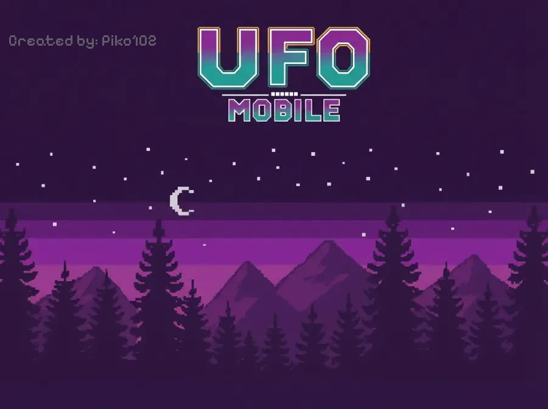

Created by: Piko102

# 🛸 UFO MOBILE - Gra Antyalkoholowa



## 📖 O Grze

**UFO MOBILE** to amatorska gra platformowa 2D z przesłaniem antyalkoholowym, osadzona w klimatach science fiction. Wciel się w bohatera, który musi uratować ludzkość przed zagrożeniem alkoholowym, zbierając kosmitów i walcząc z wrogimi kuflamipiwa!

Gra łączy klasyczną mechanikę platformówek z unikalną fabułą o kosmitach, UFO i walce o trzeźwość. Przejdź przez 5 poziomów pełnych wyzwań, by dotrzeć do finałowego starcia z bossem!

## 🎮 Jak Grać

### Sterowanie

#### Klawiatura (PC):
- **Strzałki** / **A, D** - Ruch w lewo/prawo
- **Strzałka w górę** / **W** / **Spacja** - Skok
- **X** - Strzał
- **Strzałka w dół** / **S** - Schylenie/interakcja

#### Ekran dotykowy (Mobile):
- **Wirtualny D-Pad** - Poruszanie się
- **Niebieski przycisk** - Strzał
- **Przycisk ze strzałką w górę** - Skok

### Cel Gry

Zbieraj **kosmitów** (👽) rozrzuconych po poziomach, unikaj lub eliminuj wrogie **kufle piwa**, i dotrzyj do końca każdego poziomu. Musisz zebrać **28 kosmitów** na każdym poziomie, aby przejść dalej!

## 🌟 Poziomy

### 🟣 Poziom 1 - Wprowadzenie
- **Klimat:** Fioletowy
- **Przeciwnicy:** 4 podstawowe kufle piwa (bez strzelania)
- **Cel:** Naucz się podstaw ruchu i zbierania kosmitów

### 🟢 Poziom 2 - Pierwsze Strzały
- **Klimat:** Zielony
- **Przeciwnicy:** 3 kufle piwa strzelające poziomo
- **Nowość:** Odblokowujesz możliwość strzelania!

### 🟠 Poziom 3 - Pierwszy Pancerz
- **Klimat:** Pomarańczowy
- **Przeciwnicy:** 4 kufle piwa z celowanym strzelaniem
- **Bonus:** Zielony pancerz (1 dodatkowe życie)

### 🔵 Poziom 4 - Podwójny Pancerz
- **Klimat:** Niebieski
- **Przeciwnicy:** 5 agresywnych kufli piwa
- **Bonus:** Niebieski pancerz (2 dodatkowe życia)

### 🔴 Poziom 5 - BOSS FIGHT!
- **Klimat:** Czerwony
- **Przeciwnik:** Gigantyczny boss + pomocnicy
- **Bonus:** Czerwony pancerz "Trzeźwość" - specjalna ochrona
- **Finał:** Epickie starcie i spektakularna zakończenie

## 💎 Przedmioty i Bonusy

| Przedmiot | Opis |
|-----------|------|
| 👽 **Kosmita** | Główny przedmiot do zbierania (28 na poziom) |
| ❤️ **Życie** | Zaczynasz z 20 punktami życia |
| 🛡️ **Pancerz Zielony** | +1 dodatkowe życie (poziom 3) |
| 🛡️ **Pancerz Niebieski** | +2 dodatkowe życia (poziom 4) |
| 🛡️ **Pancerz Czerwony "Trzeźwość"** | Specjalna ochrona na poziomie bossa |

## 🎵 Oprawa Audiowizualna

Gra zawiera:
- 🎼 **Dynamiczną muzykę tła** dla każdego poziomu
- 🎵 **Specjalną muzykę bossa** na poziomie 5
- 🎶 **Muzykę końcową** podczas finałowej sekwencji
- 🔊 **Efekty dźwiękowe:** skok, strzał, zbieranie kosmitów, interakcje
- 🎨 **Unikalne tła** dla każdego poziomu
- 🌈 **Kolorystyka** dostosowana do klimatu poziomu

## 🚀 Jak Uruchomić

### Metoda 1: Bezpośrednie uruchomienie
1. Pobierz wszystkie pliki gry do jednego folderu
2. Otwórz plik `index.html` w przeglądarce internetowej
3. Kliknij przycisk "GRAJ!" i rozpocznij przygodę!

### Metoda 2: Lokalny serwer (zalecane)
Jeśli gra nie działa poprawnie po otwarciu pliku bezpośrednio, uruchom lokalny serwer:

**Python 3:**
```bash
python -m http.server 8000
```

**Node.js:**
```bash
npx http-server
```

Następnie otwórz `http://localhost:8000` w przeglądarce.

## 📱 Kompatybilność

Gra działa na:
- ✅ **Komputery PC** (Chrome, Firefox, Edge, Safari)
- ✅ **Smartfony** (Android, iOS)
- ✅ **Tablety**
- ✅ **Tryb pełnoekranowy** - zalecany dla najlepszych wrażeń!

## 🎯 Przesłanie Gry

**UFO MOBILE** to nie tylko rozrywka - to gra z ważnym przesłaniem społecznym. Poprzez zabawną i angażującą rozgrywkę, gra promuje:

- 🚫 **Świadomość zagrożeń alkoholowych**
- 💪 **Trzeźwość jako siłę**
- 🌟 **Pozytywne wybory życiowe**
- 🛡️ **Ochronę przed uzależnieniami**

Finałowe przesłanie gry brzmi: **"DZIĘKUJĘ ZA NIE PICIE!"**

## 🛠️ Technologia

Gra została stworzona w technologii:
- **HTML5 Canvas** - renderowanie grafiki
- **JavaScript** - logika gry
- **CSS3** - stylizacja interfejsu
- **Responsive Design** - dostosowanie do różnych urządzeń

## 📝 Wskazówki dla Graczy

1. 💡 **Zbieraj wszystkich kosmitów** - potrzebujesz 28 na każdym poziomie!
2. 🎯 **Celuj precyzyjnie** - amunicja jest nieograniczona, ale wrogowie szybko strzelają
3. 🛡️ **Chroń pancerze** - są bardzo pomocne w trudnych sytuacjach
4. 🏃 **Ucz się wzorców** - każdy poziom ma swoją strategię
5. 👾 **Boss wymaga cierpliwości** - obserwuj jego ataki i znajdź odpowiedni moment
6. 🎮 **Ćwicz skakanie** - precyzyjne skoki to klucz do sukcesu

## 🏆 Osiągnięcia

Czy potrafisz:
- ✨ Przejść grę bez straty życia?
- ⚡ Zebrać wszystkie kosmity na czas?
- 🎯 Pokonać bossa bez użycia pancerza?
- 🌟 Ukończyć grę w jednym podejściu?

## 👨‍💻 O Projekcie

**UFO MOBILE** to amatorski projekt stworzony z pasją do gier retro i chęci przekazania ważnego społecznego przesłania. Gra łączy nostalgię za klasycznymi platformówkami z nowoczesnym podejściem do tematyki antyalkoholowej.

## 📜 Licencja

Projekt amatorski stworzony w celach edukacyjnych i rozrywkowych.

---

## 🎮 Miłej Zabawy!

Pamiętaj - to tylko gra, ale przesłanie jest prawdziwe. Baw się dobrze i **zostań trzeźwy!** 🛸✨

**Powodzenia w ratowaniu ludzkości przed alkoholowym zagrożeniem!**
